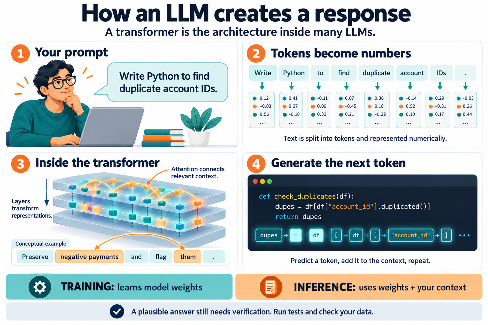

# Section 1 — Understanding LLMs and Transformers

An **LLM** is a model trained to process and generate language. A **transformer** is the neural-network architecture used by many LLMs. They describe different things: the model’s purpose and the design that makes it work.

We will follow this example throughout:

> Write a Python function that checks duplicate account IDs.

## Visual overview

**Read the four panels in order:** prompt → numerical representations → transformer processing → generated response.

The image is a conceptual illustration. Its token splits, numerical values, and attention connections are illustrative, not measurements from a particular model. The code shown demonstrates a possible response, not a complete specification for duplicate detection. In pandas, `duplicated()` defaults to marking occurrences beyond the first; identifying every row in a duplicate group requires a different setting.

## 1. What does “large language model” mean?

- **Language:** it works with sequences representing text, including natural language and code.
- **Model:** it uses learned numerical parameters to calculate outputs.
- **Large:** it has many parameters and is trained on substantial amounts of data.

Parameters, also called **weights**, are numbers adjusted during training. They encode learned patterns rather than forming a searchable table of facts. Language-model training can involve predicting missing text or the next token; generative models commonly use next-token prediction.

Illustrative examples:

| Input | A plausible continuation |
|---|---|
| “The capital of Spain is…” | “Madrid” |
| “To group rows in a dataframe…” | A grouping operation |
| “The customer made no payments, so…” | An explanation depending on the surrounding context |

Repeated prediction across varied examples teaches patterns that support translation, summarisation, coding, and other tasks.

**For your work:** a model may know common Python patterns, but that does not establish your portfolio’s business rules or the actual columns in your dataframe.

## 2. How does text become something the model can process?

The model performs numerical calculations, so text must first become numbers.

A **tokenizer** splits your text into tokens and maps them to numerical IDs. A token may represent a word, part of a word, punctuation, or another text unit. The exact split depends on the tokenizer.

Tokens are the units the model processes, but they are not always complete words or always subwords: a tokenizer may also produce punctuation, characters, or byte-level units. A rough rule for English text is about four characters per token, although code, numbers, whitespace, and other languages can differ substantially. A medium-sized README might therefore occupy a few thousand tokens, but the only reliable count comes from the tokenizer used by the model. You can inspect examples with the [OpenAI Tokenizer](https://platform.openai.com/tokenizer).

Token counts matter operationally because API providers commonly charge for input and output tokens, and because tokens consume the model's finite context window. Rates differ by provider and model; Anthropic's [pricing page](https://claude.com/pricing) is one example.

For illustration, parts of the request might appear as:

`Write` · `a` · `Python` · `function` · `duplicate` · `account` · `IDs`

This is a simplified example, not an actual tokenizer output.

The **token ID** identifies the token. An **embedding** represents it as a vector: a list of learned numbers. In the original transformer, positional information is also added so the model can use the sequence’s order.

Embedding models can also create dense vectors for whole passages. Texts with similar meanings tend to have nearby vectors, which makes embeddings useful for **semantic search** and **retrieval-augmented generation (RAG)**. A knowledge tool exposed through an MCP server may use embeddings internally, although MCP itself does not require them.

These are different concepts:

| Concept | Meaning |
|---|---|
| Token | A unit of text produced by the tokenizer. |
| Token ID | The numerical identifier assigned to that token. |
| Embedding | A learned vector representation used in model calculations. |
| Positional information | Information enabling the model to use sequence order. |

Order matters:

> The customer paid the bank.

> The bank paid the customer.

The words are similar, but their relationships change.

## 3. What is a transformer?

A transformer processes numerical representations through layers that combine information across the sequence.

Its central mechanism is **attention**: a calculation that determines how information from different token positions contributes to the representation being processed. It helps capture relationships between words, even when they are far apart. 

Consider this fictional instruction:

> Some payments are negative because they are reversals. Preserve them and flag them for review.

To interpret **“them”**, the model needs information from earlier words. Attention provides a mechanism for combining that information.

This is a conceptual example. It does not mean every attention head explicitly identifies pronouns or follows the instruction correctly.

## 4. How does attention work?

Inside an attention layer, the model creates three representations from token vectors:

| Representation | Helpful intuition |
|---|---|
| **Query — Q** | What information is this position looking for? |
| **Key — K** | What information can another position be matched on? |
| **Value — V** | What information will that position contribute? |

The query is compared with keys to calculate scores. Those scores become weights, which determine how values are combined. These are learned mathematical operations; the questions above are analogies. 

For your coding request, relationships between *duplicate*, *account*, and *IDs* help shape the representation used to generate an answer.

**Multi-head attention** performs several attention calculations in parallel, allowing different learned relationships to contribute. The outputs are combined. 

Attention does **not** verify whether `account_id` exists in your dataframe. That requires inspecting your schema or executing code.

## 5. What else happens inside a transformer layer?

Attention is only part of the computation:

| Component | Role |
|---|---|
| **Attention** | Combines information across token positions. |
| **Feed-forward network** | Applies further learned transformations at each position. |
| **Residual connections** | Carry information around a transformation and add it back. |
| **Normalisation** | Helps manage numerical representations through the layers. |

Stacking layers builds progressively transformed representations. The original transformer combines these components in encoder and decoder blocks. 

You do not need to memorise every mathematical operation before the course. First understand what the components contribute and how they relate.

## 6. How does it generate an answer?

A generative LLM calculates scores for possible next tokens, converts them into probabilities, and selects a token according to its decoding method. It then continues using the tokens generated so far. 

For illustration:

| Possible next token | Invented probability |
|---|---:|
| `def` | 60% |
| `import` | 25% |
| `Here` | 15% |

These numbers are illustrative. The model might start with a function definition, an import, or an explanation.

It repeats the process until it finishes or reaches a limit. Selection can use the highest-scoring token or sampling, which helps explain why outputs can differ between runs.

Sampling controls influence that variation:

| Control | Effect |
|---|---|
| **Temperature** | Rescales the token distribution. Lower values usually make output more repeatable; higher values allow more variation. A value of `0` is often close to greedy decoding, but does not guarantee identical output on every platform. |
| **Top-p** | Restricts sampling to the smallest set of tokens whose cumulative probability reaches a threshold. |
| **Top-k** | Restricts sampling to the `k` highest-scoring candidates. Not every API exposes this control. |

Values around `0.7` to `1.0` are often used for brainstorming or naming, but useful settings depend on the model and task. These are API-level decoding controls. Coding assistants such as GitHub Copilot, Claude Code, Cursor, and Devin usually manage decoding internally rather than exposing a temperature control in their interfaces. When you call a model API directly, the available controls depend on that API.

Try asking a coding assistant for the same variable name or commit message twice. Differences between the answers illustrate sampling and other nondeterministic parts of the serving system, even when the interface does not expose those settings.

The **context window** is the maximum amount of tokenised information the model can consider for one request, generally including the input and generated output. Some frontier models advertise windows around one million tokens or more, but the exact limit is model-specific and can change. A large window is a ceiling, not a target: relevant information can become harder to retrieve reliably in very long inputs, a behaviour often called *lost in the middle*. This leads directly to context rot in Module 1: curate the context rather than filling the window. See Anthropic's [context-window documentation](https://platform.claude.com/docs/en/build-with-claude/context-windows) for one provider-specific example.

**The probability concerns a continuation, not whether a factual claim is true.** 

This distinction explains why LLMs can **hallucinate**. The model does not check every claim against reality; when context is missing or ambiguous, it can continue with a plausible package name, endpoint such as `/api/users`, or API method that does not exist. This is a consequence of generating from learned probability patterns without sufficient grounding, not a truth-validation mechanism failing after generation.

Andrej Karpathy uses *jagged intelligence* for the strikingly uneven shape of model capabilities and *anterograde amnesia* for the fact that a model does not consolidate each conversation into its weights. A product may provide external persistent memory, but the model's immediate working information still comes from the current context.

Generating Python code and executing that code are separate operations. A model-generated function still needs to be checked against the requirement and tested.

## 7. Are all transformers the same?

There are three major architectural families:

| Architecture | Typical use | Example |
|---|---|---|
| **Encoder-only** | Representing and classifying input text | BERT |
| **Decoder-only** | Generating text from preceding context | GPT-style models |
| **Encoder–decoder** | Generating an output sequence from an input sequence | T5 |

Many generative LLMs use decoder-only architectures. During causal generation, a position can use preceding tokens but cannot look ahead at tokens that have not yet been generated. 

The original transformer was designed with both an encoder and a decoder. A decoder-only model does not require a separate encoder. [1, 5]

## 8. Training versus using the model

During **training**, weights change as the model learns from examples. During **inference**, the trained model processes your input and generates an output.

After pretraining, models can receive further training to improve instruction following. That helps turn text-generation capabilities into useful responses to requests. 

A common simplified progression for modern models is:

| Stage | What it contributes |
|---|---|
| **Base pretraining** | Learns to predict tokens from large datasets; a base model is not necessarily a reliable instruction follower. |
| **Instruction tuning** | Further trains the model on examples of instructions and responses. |
| **Preference optimisation / RLHF** | Uses human preferences or related feedback methods to favour more helpful and appropriate responses. |
| **RLVR** | Uses automatically verifiable rewards, such as whether an answer is correct or code passes tests, to improve performance on tasks with checkable outcomes. |

Not every model follows exactly this pipeline. **Reinforcement learning from verifiable rewards (RLVR)** helped advance reasoning models by rewarding successful intermediate work and final answers on verifiable tasks.

When an interface offers a **thinking** or reasoning mode, it generally allocates more computation to working through the problem before returning the final answer. This usually means more latency and may mean greater cost, but can reduce errors on complex debugging and planning tasks. It is unnecessary for many trivial tasks, and the exact implementation depends on the provider.

| Activity | What changes? |
|---|---|
| Pretraining | Model weights are learned from training data. |
| Fine-tuning | A pretrained model’s weights are adjusted through further training. |
| Providing a prompt or document | The context available for that interaction changes. |
| Inference | The model uses its trained weights and available context to calculate an output. |

Providing a prompt or document is different from updating the model’s weights through training.

That distinction also helps with a common engineering decision:

| Need | Usually start with |
|---|---|
| Frequently changing or source-backed knowledge | **RAG**, which retrieves relevant information and adds it to the inference context. |
| A specialised response style, format, or repeated behaviour | **Fine-tuning**, which adjusts model weights. |

This is a starting rule rather than a universal choice; systems can combine both approaches. **RAG and MCP are not synonyms:** RAG is a retrieval pattern, while MCP is a protocol through which an assistant can access tools and data. Connecting an MCP server to a knowledge base can provide the retrieval step of a RAG system without requiring the client to implement that integration directly.

For a deeper treatment of model training, see Andrej Karpathy's [Neural Networks: Zero to Hero](https://www.youtube.com/playlist?list=PLXYLzZ3XzIbi4lL43O6fIU_ojuZwBO6vi) and [Let's build GPT from scratch](https://www.youtube.com/watch?v=kCc8FmEb1nY).

## 9. Context and verification in your work

Give the model explicit, relevant context: the files, documentation, schemas, constraints, and examples needed for the task. Ask for sources when claims should be traceable, and verify critical details such as package names, endpoints, and external APIs, where plausible inventions are especially costly.

Suppose an LLM generates code to check duplicates. You still need to define:

- Whether the key is `account_id` or a combination such as `portfolio_id` and `account_id`.
- How nulls should be handled.
- Whether “duplicates” means repeated IDs, all affected rows, or rows beyond the first occurrence.
- Which tests demonstrate the expected behaviour.

For example, with IDs `[A, A, B, C, C, C]`:

| Metric | Result |
|---|---:|
| Repeated IDs | 2: A and C |
| Rows in duplicate groups | 5 |
| Rows beyond the first occurrence | 3 |

The transformer helps the model interpret your specification and generate code. **Your specification, actual data schema, and executed tests establish whether that code is suitable.**

The same distinction applies to financial explanations. A plausible statement about recoveries needs support from the relevant data, definitions, or calculations.

The practical lessons are straightforward:

- Learn to manage tokens, context windows, sampling controls, and embeddings; these concepts outlast individual model versions.
- Treat model output as a prediction, not as verified knowledge. Supply relevant context and check critical claims.
- Start with retrieval when knowledge changes frequently; consider fine-tuning when behaviour or style is the main requirement.
- Use reasoning modes when the complexity justifies their additional latency and cost.

## 10. Quick glossary

| Term | Definition |
|---|---|
| LLM | A large language model trained to process and generate language. |
| Transformer | A neural-network architecture built around attention and other learned transformations. |
| Token | An input/output unit of text. |
| Embedding | A dense numerical vector representing a token, passage, or other input for model calculations or similarity search. |
| Parameter / weight | A learned numerical value in the model. |
| Context | Information available to the model for the current response. |
| Context window | The maximum tokenised input and output a model can consider in one request. |
| Attention | A mechanism combining information across token positions. |
| Training | Learning or adjusting model weights. |
| Inference | Using the trained model to calculate outputs. |
| RAG | Retrieval-augmented generation: retrieving relevant information and adding it to the model's context. |
| Fine-tuning | Further training that adjusts a pretrained model's weights. |

